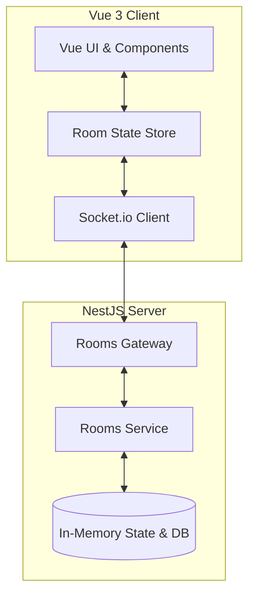

# Project Architecture and Patterns

This document outlines the architectural patterns, communication models, and code structures used in the **Resilient Heisenberg** Scrum Planning Poker application.

## 🏗️ Architectural Overview

The application is built using a decoupled client-server architecture:
- **Backend (NestJS)**: A progressive Node.js framework providing a structured, modular server environment. It handles persistent configurations, WebSocket gateways, and in-memory voting synchronization.
- **Frontend (Vue 3 + Vite)**: A reactive web user interface styled using TailwindCSS and custom glassmorphism components. It uses Socket.io-client to establish bidirectional, low-latency communication with the backend.



---

## 🎨 Architectural Design Patterns

### 1. WebSockets Gateway Pattern (`RoomsGateway`)
The backend communicates with clients primarily through real-time events using **Socket.io**.
- **Bidirectional Sync**: Real-time state changes (voted, revealed, chat messages) are broadcast instantly to all clients in a specific room.
- **Connection Handshake**: Authentic connection setups require query parameters (`userId`, `nickname`, `emoji`, `roomId`) passed during handshake to identify users instantly.

### 2. In-Memory Session State Management
Active voting values are stored in-memory inside the `RoomsService` to preserve performance and avoid unnecessary database writes:
- **State Structure**:
  ```typescript
  export interface ActiveRoomState {
    activeTaskId: string | null;
    votingRevealed: boolean;
    votes: Record<string, string>; // userId -> voteValue
    connectedUsers: Set<string>;
  }
  ```
- State transitions (voting, revealing, resetting) are handled via transactions on this in-memory object and broadcasted to keep all users aligned.

### 3. Glassmorphic Micro-interaction UI (Frontend)
The frontend utilizes a modern dark/glassmorphic design language:
- **Responsive Layouts**: Designed to be responsive, adapting between mobile, tablet, and desktop views.
- **Glassmorphism CSS**: Semi-transparent backgrounds, blur filters, and thin borders are implemented via Tailwind utility classes to create depth.
- **Micro-animations**: Interactive elements such as Poker Cards, Dialog actions, and Chat panels feature transitions on hover and active click states.

---

## 📜 Key Design Patterns Implemented

| Pattern | Location | Purpose |
| :--- | :--- | :--- |
| **Modular NestJS Architecture** | `/backend/src` | Segregates controllers, services, gateways, and models into clean directories. |
| **Event-Driven WebSockets** | `/backend/src/rooms/rooms.gateway.ts` | Dispatches action events (`castVote`, `revealVotes`, `sendMessage`) and broadcasts state changes. |
| **Reactive Store Pattern** | `/frontend/src/stores/room.ts` | Keeps client reactive states updated when receiving WebSockets data stream. |
| **Helper Composition** | `/backend/src/rooms/rooms.service.ts` | Standardized mathematical calculations (Mean, Median, Modes) offloaded to helper functions. |

---

> **To start the complete development environment:**
> Run `npm run dev` at the root of the project. This will boot both backend and frontend concurrently.

